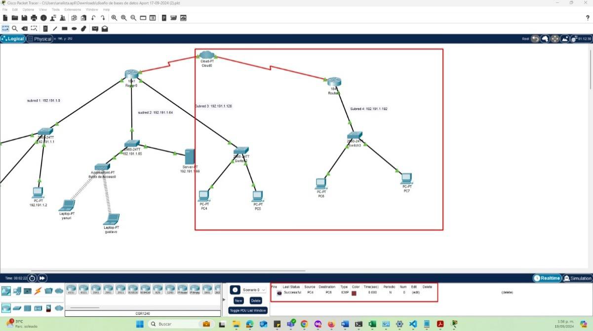
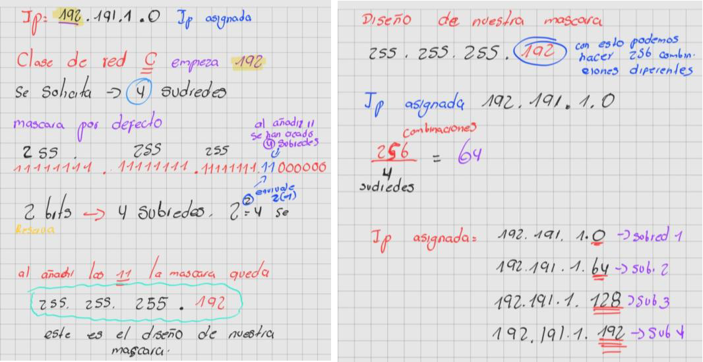
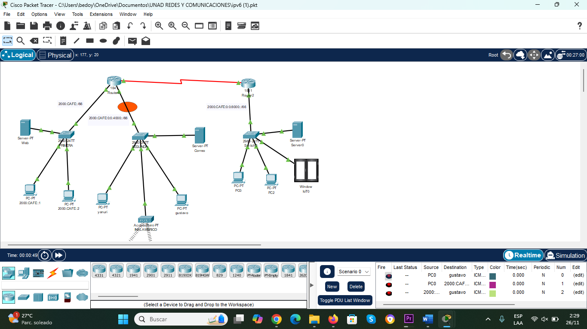
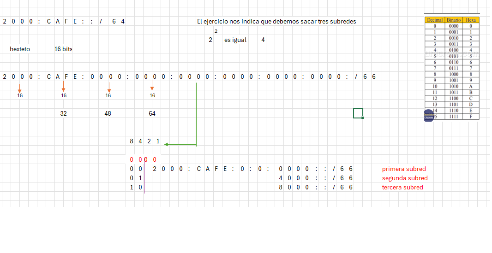

# 🌐 Diseño y Simulación de Red Académica en Cisco Packet Tracer

## Descripción

Proyecto académico enfocado en el diseño y simulación de una red académica utilizando Cisco Packet Tracer.

La solución propuesta contempla una infraestructura basada en IPv4 e IPv6, compuesta por routers, switches, puntos de acceso, servidores y múltiples subredes que permiten la comunicación entre diferentes áreas de una institución educativa.

---

## Objetivos

- Diseñar una red académica funcional.
- Implementar direccionamiento IPv4 e IPv6.
- Aplicar conceptos de subneteo y segmentación de red.
- Simular servicios de red en un entorno controlado.
- Comprender la interacción entre dispositivos de red y protocolos de comunicación.

---

## Herramientas utilizadas

- Cisco Packet Tracer
- IPv4
- IPv6
- Routing
- Switching
- Modelo OSI
- TCP/IP

---

# Arquitectura de la Red

La red fue diseñada utilizando una arquitectura LAN compuesta por:

- Dos routers principales.
- Cuatro subredes.
- Switches de acceso.
- Punto de acceso inalámbrico.
- Servidor web.
- Servidor de correo.
- Dispositivos finales conectados a la red.

## Topología IPv4

---

# Direccionamiento IPv4

Se realizó la planificación y asignación de direcciones IP para cada subred de la infraestructura.

## Cálculo de subredes

---

# Implementación IPv6

Como complemento al diseño principal, se desarrolló una versión de la red utilizando direccionamiento IPv6.

## Topología IPv6

## Planificación IPv6

---

# Servicios Implementados

La infraestructura contempla servicios básicos de red:

- Servicio Web.
- Servicio de Correo Electrónico.
- Conectividad LAN.
- Conectividad inalámbrica mediante Wi-Fi.
- Comunicación entre subredes.

---

# Estándares y Protocolos Utilizados

## IEEE 802.3

Tecnología Ethernet utilizada para la comunicación en redes cableadas.

## IEEE 802.11

Tecnología Wi-Fi utilizada para redes inalámbricas.

## HTTP / HTTPS

Protocolos utilizados para el acceso a servicios web.

## SMTP

Protocolo utilizado para el envío de correo electrónico.

## IP

Protocolo encargado del direccionamiento y enrutamiento de paquetes.

---

# Resultados Obtenidos

- Diseño funcional de una red académica segmentada.
- Implementación de direccionamiento IPv4 e IPv6.
- Simulación de servicios de red.
- Aplicación de conceptos de routing y switching.
- Comprensión práctica del modelo OSI y la arquitectura TCP/IP.

---

# Contenido del Repositorio

- Archivos de simulación Packet Tracer.
- Diagramas de topología.
- Planificación de direccionamiento IPv4.
- Planificación de direccionamiento IPv6.

---

## Autor

**Jeikson Bedoya Gómez**

Proyecto desarrollado como parte de la formación en Ingeniería de Sistemas.
